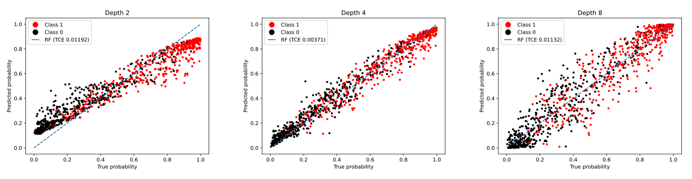

# Random Forest Calibration

This repository contains the code for the paper: [Random Forest Calibration](https://to_be_added)



It is often stated in the literature that Random forests generally exhibit relatively good calibration performance when contrasted with other machine-learning methods. Nevertheless, in sensitive applications, the necessity to calibrate output probability distributions remains a formidable challenge. Existing literature has indicated that traditional calibration methods, such as isotonic regression, do not substantially enhance the calibration of random forest probability distributions unless supplied with extensive calibration data sets. This can pose a significant challenge in many scenarios characterized by limited data availability. To the best of current knowledge, there is no extensive study comparing various calibration methods specifically for Random Forest. We investigate calibration methods applicable or tailored for Random Forests, ranging from scaling techniques to advanced algorithms. Our experimental section employs synthetic and real-world datasets to unravel the intricacies of RF probability estimates, scrutinize hyper-parameter impacts, and compare calibration methods systematically. This study contributes practical guidance for practitioners deploying well-calibrated models, offering a comprehensive guide for Random Forest calibration.


## Setup
1. Clone the repository
2. Create a new virtual environment and install the requirements:
```shell
 pip install -r requirements.txt
```
3. Activate the virtual environment
4. Run the calibration experimetn of choise from the Experiments folder


## Citation

If you use this code, please cite our paper:

